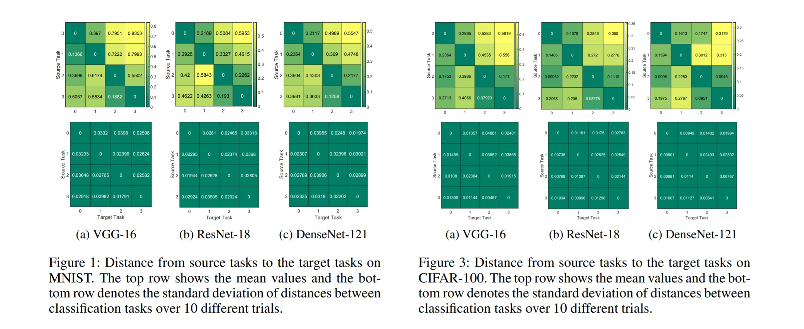
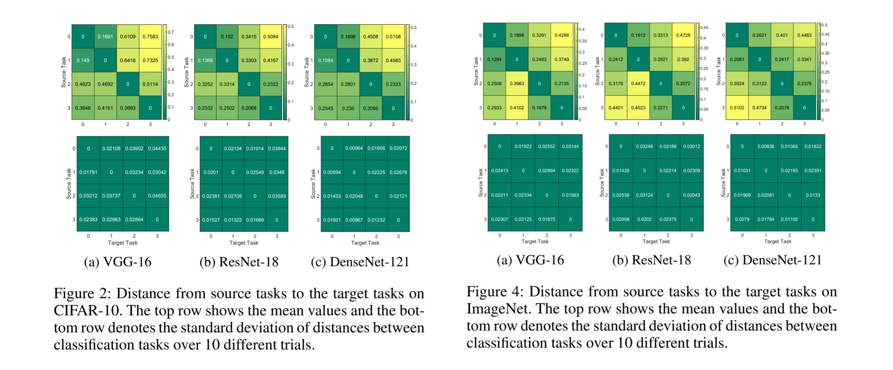
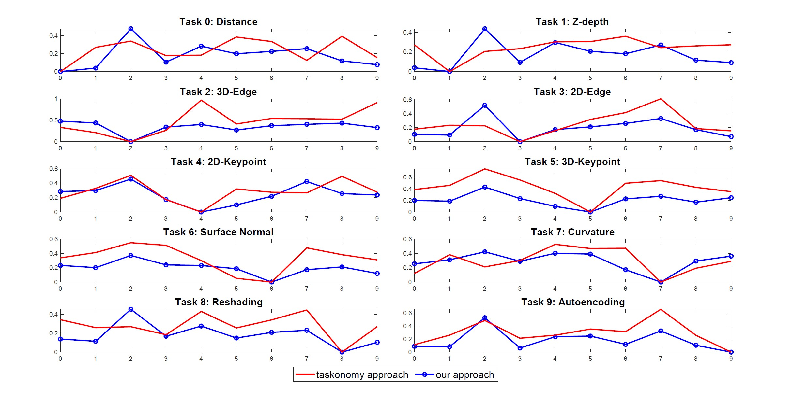
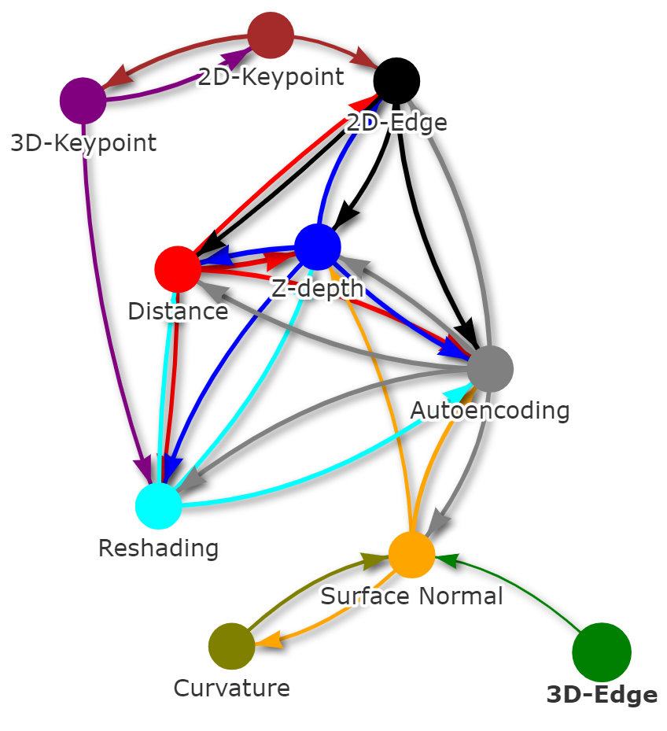

# Fisher Task Distance and Its Applications in Transfer Learning and Neural Architecture Search
This is the source code for Fisher Task Distance and Its Applications in Transfer Learning and Neural Architecture Search paper (https://arxiv.org/abs/2103.12827).

## Description

We formulate an asymmetric (or non-commutative) distance between tasks based on Fisher Information Matrices. We provide proof of consistency for our distance through theorems and experiments on various classification tasks. We then apply our proposed measure of task distance in transfer learning
on visual tasks in the Taskonomy dataset. Additionally, we show how the proposed distance between a target task and a set of baseline tasks can be used to reduce the neural architecture search space for the target task. The complexity reduction in search space for task-specific architectures is achieved by building on the optimized architectures for similar tasks instead of doing a full search without using this side information. Experimental results demonstrate the efficacy of the proposed approach and its improvements over other methods.

## Getting Started

### Dependencies

* Requires Pytorch, Numpy
* MNIST dataset (https://www.kaggle.com/oddrationale/mnist-in-csv)
* CIFAR-10 (https://www.cs.toronto.edu/~kriz/cifar.html)
* CIFAR-100 (https://www.cs.toronto.edu/~kriz/cifar.html)
* ImageNet (https://image-net.org/challenges/LSVRC/index.php)
* Taskonomy (http://taskonomy.stanford.edu/)

### Executing program

* First, we define tasks in MNIST, CIFAR-10, CIFAR-100, ImageNet, Taskonomy datasets and use the CNN to train on each task. The weights of the trained CNN is saved for each task.
```
python train_task_mnist.py
python train_task_cifar.py
python train_task_cifar100.py
python train_task_taskonomy.py
```
* Next, we compute the Fisher Information matrices for each pair of tasks using the base task's network. Then, we identify the closest tasks based on the Fréchet of the Fisher Information matrices
```
python fisher-distance.py
python fisher-distance_taskonomy.py
```
Lastly, the FUSE algorithm is applied to find the suitable architecture for the incoming task:
```
python NAS_FUSE.py
```

### Fisher Task Distance (FTD) Consistency
The following graphs indicate the consistancy of the Fisher Task distance on various datasets and different neural network architectures.
<p align="center">
  
  <br>
</p>

### Results on Transfer Learning
The graph below shows the comparison of task affinity between our approach and Taskonomy approach for each task. 
<p align="center">
  
</p>

The atlas plot of tasks (below) found from our approach indicates the computed relationship between tasks according to locations in space.
<p align="center">
  
</p>

### Results on Transfer Learning
The table below indicates the comparison of our TA-NAS framework with the hand-designed image classifiers, and state-of-the-art NAS
methods on Task 2 (binary classification) of MNIST.
| Architecture | Accuracy (%) | Paramameters (M) | GPU days |
| :---         |    :---:  |     :---:        |  :---:   |
| VGG-16       | 99.41     |  14.72    | - |
| ResNet-18    | 99.47     |  11.44    | - |
| DenseNet-121 | 99.61     |  6.95     | - |
| Random Search| 99.52     |  2.12     | 5 |
| ENAS (1st)   | 94.29     |  4.60     | 2 |
| ENAS (2nd)   | 94.71     |  4.60     | 4 |
| DARTS (1st)  | 98.82     |  2.17     | 2 |
| DARTS (2nd)  | 99.44     |  2.23     | 4 |
| PC-DARTS (1st)| 98.76    |  1.78     | 2 |
| PC-DARTS (2nd)| 99.88    |  2.22     | 4 |
| TE-NAS        | 99.71    |  2.79     | 2 |
| TA-NAS (ours) | 99.86    |  2.14     | 2 |

The table below indicates the Comparison of our TA-NAS framework with the hand-designed image classifiers, and state-of-the-art NAS methods on Task 2 (4-class classification) of CIFAR-10.
| Architecture | Accuracy (%) | Paramameters (M) | GPU days |
| :---         |    :---:  |     :---:        |  :---:   |
| VGG-16       | 86.75     |  14.72    | - |
| ResNet-18    | 86.93     |  11.44    | - |
| DenseNet-121 | 88.12     |  6.95     | - |
| Random Search| 88.55     |  3.65     | 5 |
| ENAS (1st)   | 73.23     |  4.60     | 2 |
| ENAS (2nd)   | 75.22     |  4.60     | 4 |
| DARTS (1st)  | 90.11     |  3.12     | 2 |
| DARTS (2nd)  | 91.19     |  3.28     | 4 |
| PC-DARTS (1st)| 92.07    |  3.67     | 2 |
| PC-DARTS (2nd)| 92.49    |  3.66     | 4 |
| TE-NAS        | 91.02    |  3.78     | 2 |
| TA-NAS (ours) | 92.58    |  3.13     | 2 |

## Authors

Cat P. Le (cat.le@duke.edu), 
<br>Mohammadreza Soltani, 
<br>Juncheng Dong, 
<br>Vahid Tarokh